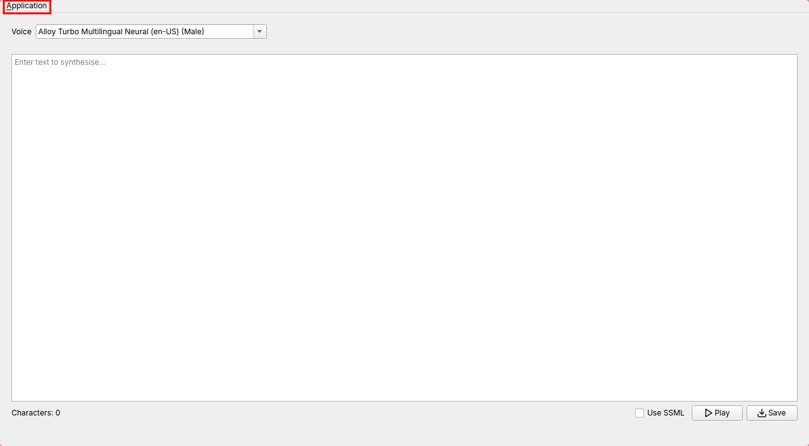
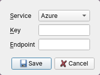
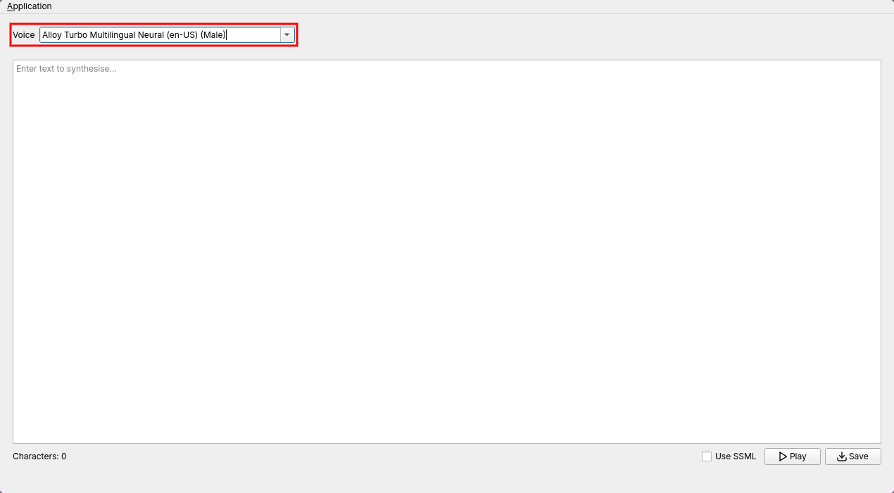
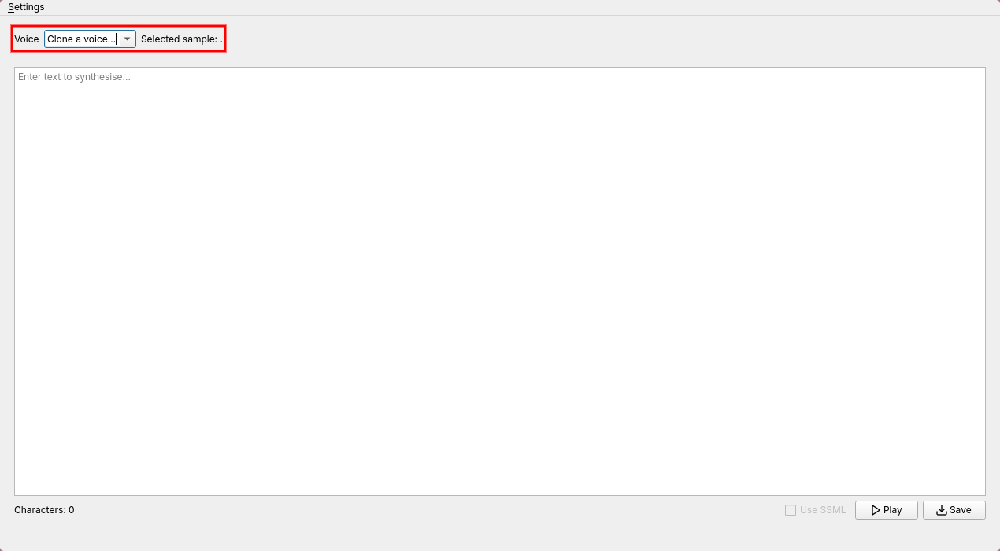

<!-- PROJECT SHIELDS -->
[![Contributors][contributors-shield]][contributors-url]
[![Forks][forks-shield]][forks-url]
[![Stargazers][stars-shield]][stars-url]
[![Issues][issues-shield]][issues-url]

<!-- PROJECT LOGO -->
 

<h3 align="center">VocalScript</h3>

  

    A TTS application
     
     
    <a href="https://github.com/BladerX11/vocalscript/issues/new?labels=bug&template=bug-report---.md">Report Bug</a>
    &middot;
    <a href="https://github.com/BladerX11/vocalscript/issues/new?labels=enhancement&template=feature-request---.md">Request Feature</a>
  

<!-- TABLE OF CONTENTS -->

  
Table of Contents

  <ol>
    <li>
      <a href="#about-the-project">About The Project</a>
      <ul>
        <li><a href="#built-with">Built With</a></li>
      </ul>
    </li>
    <li>
      <a href="#getting-started">Getting Started</a>
      <ul>
        <li><a href="#prerequisites">Prerequisites</a></li>
        <li><a href="#installation">Installation</a></li>
      </ul>
    </li>
    <li><a href="#usage">Usage</a></li>
    <li><a href="#contributing">Contributing</a></li>
    <li><a href="#contact">Contact</a></li>
    <li><a href="#acknowledgments">Acknowledgments</a></li>
  </ol>

<!-- ABOUT THE PROJECT -->
## About The Project
### Built With

* [![Python][Python]][Python-url]
* [![Qt][Qt]][Qt-url]
* [![Azure][Azure]][Azure-url]

(<a href="#readme-top">back to top</a>)

<!-- GETTING STARTED -->
## Getting Started

To get a local copy up and running follow these simple example steps.

### Prerequisites

1. [ffmpeg](https://ffmpeg.org/download.html): Direct playback for linux

### Installation

1. Download the [latest release](https://github.com/BladerX11/vocalscript/releases/latest) for the correct OS, indicated after the application name.

    

2. Launch the application and click on Application -> Settings in the menubar. For MacOS, it will be the application name -> Preferences in your global menu. Select your prefered service, enter your information and click save.

    
    

3. Select you voice that matches the language you are using.

    

(<a href="#readme-top">back to top</a>)

<!-- USAGE EXAMPLES -->
## Usage
### Setting up services
#### Azure

1. Create [Azure subscription](https://azure.microsoft.com/free/cognitive-services) and an [AI Services resource](https://portal.azure.com/#create/Microsoft.CognitiveServicesAIFoundry)
2. Navigate to the [Azure portal](portal.azure.com), then select your speech service resource to view its keys and endpoints.

#### Kokoro

1. Download [espeak-ng](https://github.com/espeak-ng/espeak-ng/blob/master/docs/guide.md). Needed for some english words and non-english languages, or they will be skipped.

#### Chatterbox

1. No further setup required.

Note: For local models, the model and voices will be downloaded and cached locally when selecting it for the first time. This will take some time.

### Saving audio

1. Enter the text to be synthesised in the text box.
2. Click the save button below the text box.

    

3. Audio files will be saved in a folder named saved where your OS data folder is, named with the date and time it was synthesised.
    * Windows: C:\Users\\\<USER>\AppData\Roaming\vocalscript\vocalscript\saved
    * Linux: ~/.local/share/vocalscript/vocalscript/saved
    * MacOS: ~/Library/Application Support/vocalscript/vocalscript/saved
    
### Playing audio

1. Enter the text to be synthesised in the text box.
2. Click the play button below the text box.

    

3. The audio will be played through the default audio output of the system.

### Using SSML (for select services)

1. Enter the SSML content to be synthesised in the text box. (Note: The selected voice above the text box will be ignored with SSML)
2. Check the SSML checkbox below the text box.

    
  
3. Click the buttons to play or save. The text content will be parsed as SSML.

### Cloning voice (for selected services)

1. Select the clone option as the voice. A file picker will open to select the sample voice wav file to clone. You can try this [sample](assets/p236_023.wav) from the [Voice Cloning Toolkit](https://datashare.ed.ac.uk/handle/10283/3443) dataset.

    

### Editing settings

The application settings can be changed through the settings window, or the settings file that will be created at the location where you OS stores configurations.

* Linux & MacOS: ~/.config/vocalscript/vocalscript.ini
* Windows: C:\Users\\\<USER>\AppData\Roaming\vocalscript\vocalscript.ini

### Checking logs

Application logs are saved where your OS data folder. It can be viewed for general operation or when errors occur.

* Windows: C:\Users\\\<USER>\AppData\Roaming\vocalscript\vocalscript\vocalscript.log
* Linux: ~/.local/share/vocalscript/vocalscript/vocalscript.log
* MacOS: ~/Library/Application Support/vocalscript/vocalscript/vocalscript.log

(<a href="#readme-top">back to top</a>)

<!-- CONTRIBUTING -->
## Contributing

Contributions are what make the open source community such an amazing place to learn, inspire, and create. Any contributions you make are **greatly appreciated**.

If you have a suggestion that would make this better, please fork the repo and create a pull request. You can also simply open an issue with the tag "enhancement".
Don't forget to give the project a star! Thanks again!

1. Fork the Project
2. Create your Feature Branch (`git checkout -b feature/AmazingFeature`)
3. Commit your Changes (`git commit -m 'Add some AmazingFeature'`)
4. Push to the Branch (`git push origin feature/AmazingFeature`)
5. Open a Pull Request

(<a href="#readme-top">back to top</a>)

### Top contributors:

<!-- CONTACT -->
## Contact

Project Link: [https://github.com/BladerX11/vocalscript](https://github.com/BladerX11/vocalscript)

(<a href="#readme-top">back to top</a>)

<!-- ACKNOWLEDGMENTS -->
## Acknowledgments

* [Lucide Icons](https://lucide.dev/icons)

(<a href="#readme-top">back to top</a>)

<!-- MARKDOWN LINKS & IMAGES -->
<!-- https://www.markdownguide.org/basic-syntax/#reference-style-links -->
[contributors-shield]: https://img.shields.io/github/contributors/BladerX11/vocalscript.svg?style=for-the-badge
[contributors-url]: https://github.com/BladerX11/vocalscript/graphs/contributors
[forks-shield]: https://img.shields.io/github/forks/BladerX11/vocalscript.svg?style=for-the-badge
[forks-url]: https://github.com/BladerX11/vocalscript/network/members
[stars-shield]: https://img.shields.io/github/stars/BladerX11/vocalscript.svg?style=for-the-badge
[stars-url]: https://github.com/BladerX11/vocalscript/stargazers
[issues-shield]: https://img.shields.io/github/issues/BladerX11/vocalscript.svg?style=for-the-badge
[issues-url]: https://github.com/BladerX11/vocalscript/issues
[Python]: https://img.shields.io/badge/Python-FFD43B?style=for-the-badge&logo=python&logoColor=blue
[Python-url]: http://python.org/
[Qt]: https://img.shields.io/badge/Qt-41CD52?style=for-the-badge&logo=qt&logoColor=white
[Qt-url]: https://www.qt.io/
[Azure]: https://img.shields.io/badge/microsoft%20azure-0089D6?style=for-the-badge&logo=microsoft-azure&logoColor=white
[Azure-url]: https://azure.microsoft.com/
